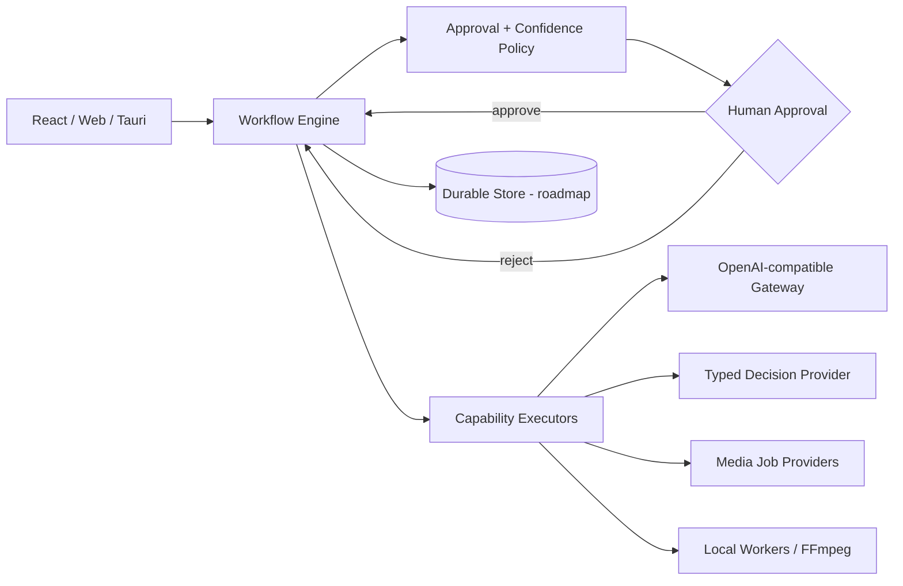

# Architecture

## Design goals

Creator Nexus separates **decision orchestration** from **execution providers**. The core knows workflow state, dependencies, risk and approval rules. It does not know how a particular LLM, renderer or social platform works.

## Core invariants

1. A step cannot execute until its declared dependencies are complete or approved.
2. High/critical risk steps require explicit human approval.
3. A configured confidence threshold can escalate otherwise automatic work.
4. Rejection is a terminal state for that step until the run is edited/restarted.
5. External irreversible actions should be represented as critical-risk steps.

## Provider contracts

`packages/adapters` defines small interfaces rather than vendor-specific workflow code. This makes it possible to add providers without rewriting the application state machine.

## Production evolution

The next persistence layer should store runs, steps, artifacts and approval receipts in SQLite on device, with optional sync to Postgres for teams. Long-running media jobs should move to a durable queue and report progress back to the run.
